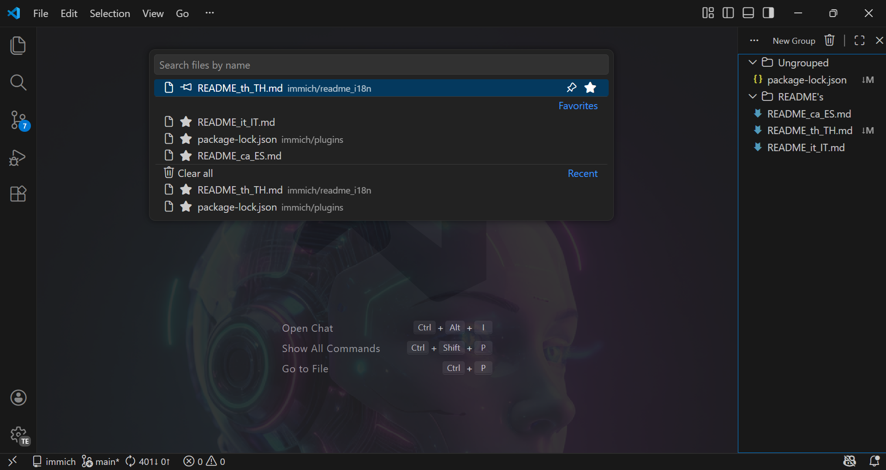

<h1 align="left">AnFavorites</h1>

<br/>

<p align="center">
  <a href="https://marketplace.visualstudio.com/items?itemName=AnAppWilos.an-favorites">
    
  </a>
  <a href="https://marketplace.visualstudio.com/items?itemName=AnAppWilos.an-favorites&ssr=false#version-history">
    
  </a>
  <a href="https://marketplace.visualstudio.com/items?itemName=AnAppWilos.an-favorites">
    
  </a>
  <a href="https://opensource.org/licenses/MIT">
    
  </a>
</p>



AnFavorites es una extensión profesional, 100% de código abierto, para Visual Studio Code que optimiza tu flujo de trabajo ofreciéndote acceso instantáneo a lo más importante.

Con un único atajo de teclado (totalmente configurable), QuickPick te permite abrir tus archivos favoritos en cuestión de segundos. Podrás gestionar de forma rápida e intuitiva tus elementos fijados más recientes e incluso utilizarlo como buscador ágil dentro de tu entorno de desarrollo.

<video src="./resources/demo01.mp4" controls="false" autoplay="true" loop="true" muted="true" width="100%"></video>

Si trabajas con varios IDEs, tus favoritos se sincronizan automáticamente entre ellos, para que nunca pierdas el hilo de lo realmente importante en tu flujo diario.

## 🚀 Características

- **Gestión Inteligente de Favoritos**: Organiza tus archivos y comandos más usados sin esfuerzo.
- **Webview Integrada**: Una interfaz limpia y moderna para gestionar tus recursos.
- **Acceso Rápido**: Ejecuta comandos y abre archivos con el mínimo de pulsaciones.
- **Soporte Multi-idioma**: Totalmente localizado para hablantes de inglés y español.
- **Logging Profesional**: Sistema de logs especializado para depuración y monitoreo.

## 🛠️ Instalación

Puedes instalar la extensión directamente desde el Visual Studio Code Marketplace:

1. Abre VS Code.
2. Ve a la vista de Extensiones (`Ctrl+Shift+X`).
3. Busca `AnFavorites`.
4. Haz clic en **Instalar**.

## 💻 Desarrollo y Contribución

¡Creemos en el poder del código abierto! Este proyecto es 100% open source y agradecemos las contribuciones de la comunidad.

### Requisitos Previos

- Node.js
- npm

### Inicio Rápido

```bash
# Clona el repositorio
git clone https://github.com/nicolasalarconrapela/an-favorites.git

# Instala las dependencias
npm install

# Compila la extensión
npm run compile

# Vigila los cambios durante el desarrollo
npm run watch
```

Presiona `F5` en VS Code para abrir una nueva ventana con tu extensión cargada.

## 📄 Licencia

Este proyecto está bajo la Licencia MIT - mira el archivo [LICENSE](LICENSE) para más detalles.

---

Hecho con ❤️ por la Comunidad Open Source.
